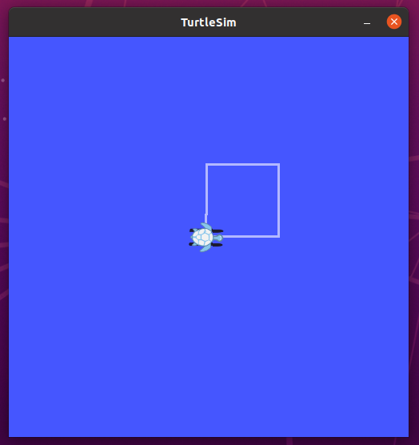

ASSIGNMET 2 README 

1. circle.py: This script moves the turbolt in a circle with a constant linear and angular velocity. The velocity messages of the linear X and angular Z are set to be equal to make the circle. These velocity messages are countionusly publihed untill a circle is made.

To launch file: roslaunch assingment2_turtlesim circle.launch

2. square_openloop.py: This script creates a square that is 2x2 with a linear velocity of 0.2m/s  in x direction and a angular velocity of 0.2 rad/s. The linear velocity message was used to draw the sides of the square box. Also, the angular velocity message was used to create the conrners by turning the robot before another edge of the robot was drawn.

To launch file: roslaunch assingment2_turtlesim openloop.luanch

3. square_closedloop.py: This script creates a sqaure that is 3x3 by using a PID contorller. The PID contoroller had two input values (constant) that allows for the user to tune the shape of the 3x3 square.

To launch file: roslaunch assingment2_turtlesim closedloop.launch

